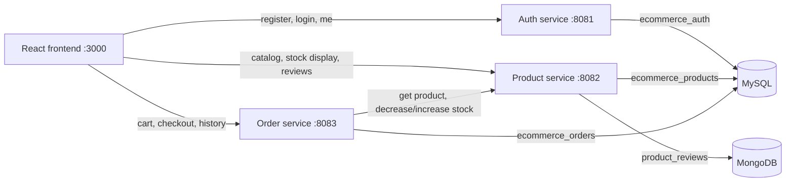
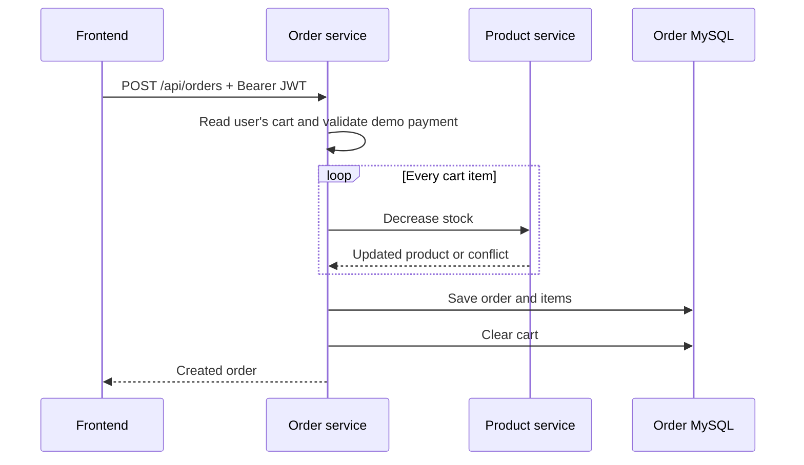

# Architecture

## Runtime view

All protected browser calls send `Authorization: Bearer <JWT>`. Auth signs the JWT; product review writes and all order/cart routes validate the same signature. The token subject is the normalized user email.

## Service ownership

- Auth owns users and credentials. Other services never receive password hashes.
- Product owns product descriptions, prices, active state, and stock. Reviews are part of this domain but stored as MongoDB documents.
- Order owns cart items, orders, order items, order/payment status, and shipping address.
- Frontend owns presentation and stores the JWT in browser local storage for this simple demo.

## Checkout sequence

If a later inventory call or order save fails, the order service makes compensating `increase` calls for stock already decreased. This is simpler than distributed transactions and appropriate for the project scope. Production systems commonly use events, idempotency keys, and a saga/outbox design.

## Data model

MySQL schemas are separated by service:

- `ecommerce_auth.users`: `id`, `name`, unique `email`, BCrypt `password`, `role`
- `ecommerce_products.products`: catalog fields, decimal price, stock, active flag, timestamps
- `ecommerce_orders.cart_items`: user email plus a unique product per user, price snapshot, quantity
- `ecommerce_orders.customer_orders`: owner, status, payment status/method, address, total, timestamps
- `ecommerce_orders.order_items`: product/price snapshots linked to an order

MongoDB collection `ecommerce_reviews.product_reviews` stores product ID, user email, rating, comment, and time. A compound unique index prevents the same user from reviewing the same product twice.

## Security decisions

- Passwords are BCrypt hashes, never returned in API responses.
- Authentication is stateless; no HTTP session is created.
- Missing, malformed, expired, or wrongly signed JWTs receive HTTP 401.
- Order queries always include the authenticated email so users cannot read another user's cart/orders.
- The demo payment accepts only `COD` or a fixed `DEMO_SUCCESS` token. It deliberately has no card-number fields.
- Secrets and database passwords come from environment variables; committed defaults are development-only.

## Failure boundaries

- Each service has structured JSON errors and validation messages.
- Pessimistic locking protects stock changes inside product-service transactions.
- Cross-service inventory compensation is best-effort; the limitation is documented rather than hidden.
- Tests isolate MySQL logic with H2 and isolate cross-service calls with mocks. Mongo review business logic is unit tested; Docker supplies real MongoDB at runtime.
